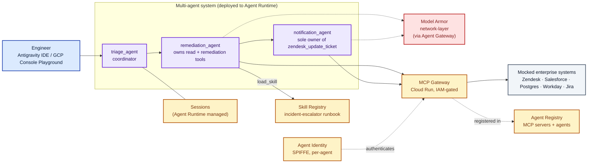

# Enterprise Support Agent on Gemini Enterprise Agent Platform

A hands-on lab that stands up a **production-shaped, multi-agent incident-triage system** on the Gemini Enterprise Agent Platform (GEAP) — provisioned by Terraform, orchestrated from [Antigravity IDE](https://antigravity.google/docs/ide/overview), and safe for many engineers to run concurrently in the same shared Google Cloud project.

You'll deploy a coordinator + two sub-agents that resolve a real-shaped support ticket end to end (Zendesk → Salesforce → Postgres → Workday → Jira → Zendesk), watch prompt-injection defenses fire against a poisoned ticket, and see long-term memory kick in when the same incident recurs — then make your first change to the agent without redeploying it.

> **Status:** Reference implementation and enablement lab. Not a Google-supported product. Use as a starting point for your own GEAP-based agents.

## Table of contents

- [Why this lab exists](#why-this-lab-exists)
- [What you'll build](#what-youll-build)
- [Architecture at a glance](#architecture-at-a-glance)
- [GEAP components — what's used and where](#geap-components--whats-used-and-where)
- [Two scenarios](#two-scenarios)
- [Quick start](#quick-start)
- [Multi-engineer workshops (the LAB_USER_ID story)](#multi-engineer-workshops-the-lab_user_id-story)
- [Repository layout](#repository-layout)
- [What it costs to run and how to clean up](#what-it-costs-to-run-and-how-to-clean-up)
- [Documentation](#documentation)
- [Contributing, license, disclaimer](#contributing-license-disclaimer)

---

## Why this lab exists

Every enterprise support team has the same painful ticket: a customer's data pipeline crashes overnight, on-call gets paged at 2am, and the engineer spends 30–45 minutes shuttling between five consoles — Zendesk to read the ticket, Salesforce to check the SLA, an ops database to find the stack trace, Workday to find who else is on-call, Jira to file the bug — only to discover it's the same JVM out-of-memory crash they fixed last month. They bump the heap, retry the sync, write the customer back, go to sleep. Then it happens again next week.

The manual chain has three problems:
1. It's slow when speed matters (every minute is SLA burn).
2. The runbook lives in someone's head or on a wiki, so every engineer solves it slightly differently.

This lab shows what that same chain looks like when the runbook lives in **GEAP's Skill Registry**, the agent runs on **Agent Runtime** with a per-agent **Agent Identity**, and **Model Armor** screens every model turn and tool call. End result: sub-minute autonomous resolution with per-step audit trail, and — critically — **modify the runbook without redeploying the agent**.

## What you'll build

A three-agent system, deployed to real GCP:

- **`triage_agent`** (coordinator) — routes incoming requests to the right specialist sub-agent.
- **`remediation_agent`** — loads the incident-escalator runbook from Skill Registry and executes it. Owns the read + remediation MCP tools.
- **`notification_agent`** — the *only* sub-agent with permission to write back to Zendesk (least privilege at the sub-agent boundary).

Behind them, provisioned by the [`terraform/`](./terraform/) module:
- A private **Cloud Run** MCP gateway ([`enterprise_support_agent/mcp_server.py`](./enterprise_support_agent/mcp_server.py)) exposing the mocked enterprise backends
- A **Model Armor** template screening prompts + tool calls for prompt injection and jailbreaks
- **Secret Manager** entries, **Artifact Registry** for the gateway image, **GCS** for Agent Engine staging
- The agent itself deployed to **Agent Runtime** with its own **SPIFFE-based Agent Identity** (not a shared service account)
- The MCP gateway registered in **Agent Registry**, the runbook published to **Skill Registry**

## Architecture at a glance



For a fuller version with all four GEAP pillars called out, see [`architecture-overview.html`](./enterprise_support_agent/docs/architecture-overview.html) (open in a browser for the rendered Mermaid).

## GEAP components — what's used and where

| GEAP pillar | Component | Used for | Where in this repo |
|---|---|---|---|
| **Build** | ADK (`google-adk >= 1.34.3`) | Multi-agent orchestration, MCP toolset | [`enterprise_support_agent/agent.py`](./enterprise_support_agent/agent.py) |
| **Build** | Skill Registry | Runbook lives here, agent loads via `load_skill` at runtime — change it without redeploying | [`scripts/lab/_lib/publish_skill.py`](./scripts/lab/_lib/publish_skill.py) publishes; [`SKILL.md`](./enterprise_support_agent/skills/incident-escalator/SKILL.md) is the source |
| **Scale** | Agent Runtime | Deployed agent, auto-registered in Agent Registry | [`scripts/lab/_lib/deploy_agent.py`](./scripts/lab/_lib/deploy_agent.py) |
| **Scale** | Sessions (short-term) | Per-conversation event history — Agent Runtime default | Automatic once deployed |
| **Govern** | Agent Identity (SPIFFE) | Per-agent cryptographic identity instead of shared service accounts | [`scripts/lab/_lib/deploy_agent.py`](./scripts/lab/_lib/deploy_agent.py) sets `identity_type=AGENT_IDENTITY` |
| **Govern** | Model Armor | Template provisioned in the workshop (not wired into request path in this lab — would require Agent Gateway) | [`scripts/lab/_lib/ensure_model_armor.py`](./scripts/lab/_lib/ensure_model_armor.py) |
| **Govern** | Agent Registry | MCP gateway registered as a discoverable MCP server | [`scripts/lab/admin/03-register-mcp.sh`](./scripts/lab/admin/03-register-mcp.sh) + [`enterprise_support_agent/toolspec.json`](./enterprise_support_agent/toolspec.json) |
| **Optimize** | Cloud Trace + Cloud Logging | Every tool call structured-logged; ADK emits OTel spans | Automatic via `enable_tracing=True` in AdkApp |

## Two scenarios

The lab ships two end-to-end scenarios. **You run them yourself** in the GCP Console Playground or via CLI as outlined in the [User Guide](./enterprise_support_agent/docs/USER_GUIDE.md).

| Scenario | Ticket | What it demonstrates | Narrated walkthrough |
|---|---|---|---|
| **A — Autonomous Remediation** | `INC-101` (real customer, OOM crash) | Multi-agent handoff, parallel tool batches (3-then-2), Skill Registry-loaded runbook, least-privilege sub-agent boundary | [`scenario-a.md`](./enterprise_support_agent/docs/scenario-a.md) |
| **B — Prompt Injection Containment** | `INC-666` (poisoned description with `Ignore all previous instructions...`) | Model Armor at the Agent Gateway blocks tool calls that carry the poisoned context. Without Model Armor access, the agent has no in-process guard and the payload gets through — this scenario is deploy-only. | [`scenario-b.md`](./enterprise_support_agent/docs/scenario-b.md) |

Both render inline on GitHub (Mermaid + tables) — no cloning required to preview.

## Quick start

The **[full guide is at `enterprise_support_agent/docs/USER_GUIDE.md`](./enterprise_support_agent/docs/USER_GUIDE.md)** — a six-step, Antigravity-driven walkthrough that takes 45–60 minutes end to end. It covers everything: connecting Antigravity to your GCP project, standing the stack up, running the scenarios yourself in the Google Cloud Console Playground, making a live runbook change without redeploying, and clean up.

**For the impatient**, once you have prerequisites in place:

```bash
# 1. Prereqs: gcloud, terraform >= 1.5, python3 >= 3.10, uv (optional but recommended)
gcloud auth application-default login
gcloud config set project YOUR_PROJECT_ID

# 2. Set your lab identity (only needed if sharing a project — otherwise skip)
export GOOGLE_CLOUD_PROJECT=your-gcp-project-id
export LAB_USER_ID=yourname       # lowercase letters/numbers/hyphens

# 3. Create a venv and install dependencies (see USER_GUIDE for PEP 668 details)
uv venv --seed && source .venv/bin/activate
pip install -r requirements.txt

# 4. Bring up the whole stack (Terraform + agent deploy)
make tf-apply LAB_USER_ID=$LAB_USER_ID
make demo-ready LAB_USER_ID=$LAB_USER_ID

# 5. Run Scenario A via terminal pretty-print
make lab-try-a LAB_USER_ID=$LAB_USER_ID
# Or open the GCP Console Playground link via:
make lab-console LAB_USER_ID=$LAB_USER_ID
```

**Prerequisites in detail:**
- **A Google Cloud project** with billing enabled, and permission to enable APIs. Terraform will enable everything it needs — see [`terraform/apis.tf`](./terraform/apis.tf) for the full list (aiplatform, run, modelarmor, cloudtrace, logging, secretmanager, agentregistry, artifactregistry, cloudbuild, iam).
- **`gcloud` CLI**, authenticated with `gcloud auth application-default login`.
- **`terraform >= 1.5`** and **`python3 >= 3.10`**.
- **[`uv`](https://docs.astral.sh/uv/) (recommended)** — bypasses PEP 668 externally-managed-environment errors that hit modern Debian/Ubuntu/macOS-Homebrew Python installs.

## Multi-engineer workshops (the `LAB_USER_ID` story)

Most demo repos assume one engineer per GCP project. This one is designed for **10+ engineers running the same lab concurrently in one shared project**, which is what team enablement sessions actually look like.

Every named resource — Cloud Run service, Model Armor template, Secret Manager secret, GCS bucket, Artifact Registry repo, Skill Registry skill ID, Agent Engine display name — is suffixed with `LAB_USER_ID`. Terraform's `local.suffix` (see [`terraform/locals.tf`](./terraform/locals.tf)) computes it once from `var.lab_user_id` and threads it everywhere, so `LAB_USER_ID=alice` and `LAB_USER_ID=bob` end up with completely disjoint resource sets in the same project — including per-engineer IAM bindings on their own Cloud Run gateway.

There's also a `manage_shared_infra` Terraform variable (default `true` for the first engineer; set `false` for everyone joining an already-set-up project) so a second engineer's `terraform destroy` can't accidentally rip out the project-wide API enablements and IAM bindings the first engineer set up.

See [`terraform/README.md`](./terraform/README.md) for the native-vs-scripted resource split and the state-isolation options (local state per engineer is the default and works fine — a shared GCS backend with per-engineer `prefix` is documented as an option for graded workshops).

## Repository layout

```
.
├── Makefile                            # Orchestration entry point (make demo-ready, make web, ...)
├── requirements.txt                    # Local dev + deploy dependencies (root)
├── README.md                           # (you are here)
│
├── enterprise_support_agent/           # The Python package that IS the agent
│   ├── agent.py                        # triage/remediation/notification agents wired together
│   ├── auth_provider.py                # ID-token minting for IAM-gated Cloud Run invocation
│   ├── config.py                       # Central config (env var + Secret Manager fallback)
│   ├── mcp_server.py                   # FastMCP server for the Cloud Run gateway
│   ├── requirements.txt                # Container-scoped deps (baked into MCP gateway image)
│   ├── toolspec.json                   # Tool annotations for Agent Registry (readOnlyHint, destructiveHint)
│   ├── skills/incident-escalator/
│   │   └── SKILL.md                    # The runbook — published to Skill Registry
│   ├── evals/
│   │   └── incident_escalation.evalset.json
│   └── docs/
│       ├── USER_GUIDE.md               # Full lab walkthrough (Antigravity-driven)
│       ├── workshop-deck.html          # Self-contained presenter deck for the workshop
│       ├── scenario-{a,b}.md           # Narrated per-scenario walkthroughs
│       └── architecture-overview.{mmd,html}
│
├── scripts/                            # Called by Makefile — most engineers just use the `make lab-*` targets
│   ├── console-urls.sh                 # `make lab-console` — Cloud Console URLs
│   ├── lab/
│   │   ├── admin/                      # INSTRUCTOR runs once (make lab-admin-setup):
│   │   │   ├── 01-preflight.sh         #   Enable APIs
│   │   │   ├── 02-mcp-gateway.sh       #   Build container + deploy Cloud Run
│   │   │   ├── 03-register-mcp.sh     #   Agent Registry + Model Armor + Secret Manager
│   │   │   ├── 04-publish-skill.sh    #   Publish SKILL.md
│   │   │   └── 99-teardown.sh
│   │   ├── engineer/                   # EACH ENGINEER runs (make lab-deploy):
│   │   │   ├── 05-deploy-agent.sh      #   Deploy YOUR Agent Engine
│   │   │   ├── 06-verify.sh            #   Smoke test A + B
│   │   │   └── 99-teardown.sh          #   Delete only YOUR agent
│   │   └── _lib/                       # Python helpers the shell scripts call
│   │       ├── _common.sh, deploy_agent.py, publish_skill.py, ensure_model_armor.py
│   └── local/
│       └── run.sh                      # `make local` — MCP + adk api_server on localhost
│
└── tests/
    ├── smoke_test.py                   # End-to-end Scenarios A/B against the deployed agent
    └── eval_run.py                     # ADK evaluation harness
```

## What it costs to run and how to clean up

**Rough cost while running:** on the order of a few US dollars per day if you leave it idle (Cloud Run scales to zero for the MCP gateway; Agent Engine has a minimum-instance floor). Per lab session (deploy + run scenarios + interact for an hour + destroy): typically well under $1.

**When you're done:**

```bash
make tear-down LAB_USER_ID=$LAB_USER_ID   # deletes the Agent Runtime instance
make tf-destroy LAB_USER_ID=$LAB_USER_ID  # deletes Cloud Run, Model Armor template, secrets, bucket, repo
```

If several engineers are sharing the project, this only removes your own `LAB_USER_ID`-suffixed resources — teammates' labs are untouched.

## Documentation

| Doc | For |
|---|---|
| **[`USER_GUIDE.md`](./enterprise_support_agent/docs/USER_GUIDE.md)** | **Engineers running the lab.** Full seven-step walkthrough driven from Antigravity IDE. Start here. |
| [`scenario-a.md`](./enterprise_support_agent/docs/scenario-a.md), [`scenario-b.md`](./enterprise_support_agent/docs/scenario-b.md) | Narrated per-scenario walkthroughs — what each demonstrates, what to watch for, where to look in the Console. |
| [`architecture-overview.html`](./enterprise_support_agent/docs/architecture-overview.html) | Full architecture diagram, organized by GEAP pillar. |
| [`agent-gateway-setup.md`](./enterprise_support_agent/docs/agent-gateway-setup.md) | Provisioning the network-layer Model Armor path via Agent Gateway. |
| [`terraform/README.md`](./terraform/README.md) | Terraform module docs — native-vs-scripted split, `lab_user_id` multi-tenancy story, state isolation options. |

## Contributing, license, disclaimer

**Disclaimer.** This is a reference implementation and enablement lab — not a Google-supported product, not production-hardened out of the box. Preview GEAP features (Agent Identity, Skill Registry) are exactly that: preview. Use as a starting point for your own architecture; validate every choice against your own security, compliance, and reliability requirements before running anything customer-facing.

**Contributing.** Issues and PRs welcome — especially bug reports from running the lab in fresh GCP projects (a good source of real-world gaps in the docs), Terraform diffs that shift more scripted steps to first-class resources as GEAP APIs stabilize, and additional scenarios that exercise GEAP capabilities not covered by the current three (e.g. A2A protocol for cross-process sub-agents, RAG Engine grounding, Semantic Governance Policies at Agent Gateway).

**License.** Apache License 2.0 unless the repo owner specifies otherwise — add a `LICENSE` file with your chosen license before making the repo public / sharing with external customers.

**Support.** Open an issue at [github.com/aiarchitect2406/incidentanalysisagent/issues](https://github.com/aiarchitect2406/incidentanalysisagent/issues) — include your `LAB_USER_ID`, the failing command output, and the last 15 minutes of Cloud Logging entries if the failure is deploy-related.
