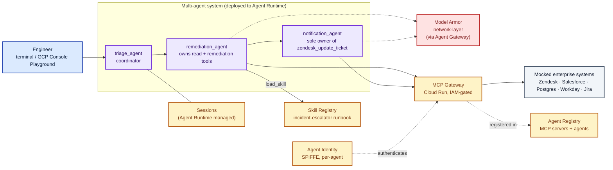

# Enterprise Support Agent on Gemini Enterprise Agent Platform

A hands-on lab that stands up a **production-shaped, multi-agent incident-triage system** on the Gemini Enterprise Agent Platform (GEAP) — provisioned by a handful of shell scripts, and safe for many engineers to run concurrently in the same shared Google Cloud project.

You'll deploy a coordinator + two sub-agents that resolve a real-shaped support ticket end to end (Zendesk → Salesforce → Postgres → Workday → Jira → Zendesk), watch what happens when a poisoned ticket tries a prompt injection, and then make your first change to the agent without redeploying it.

> **Status:** Reference implementation and enablement lab. Not a Google-supported product. Use as a starting point for your own GEAP-based agents.

## Table of contents

- [Why this lab exists](#why-this-lab-exists)
- [What you'll build](#what-youll-build)
- [Architecture at a glance](#architecture-at-a-glance)
- [GEAP components — what's used and where](#geap-components--whats-used-and-where)
- [Two scenarios](#two-scenarios)
- [How you run this lab](#how-you-run-this-lab)
- [Prerequisites](#prerequisites)
- [Step-by-step walkthrough](#step-by-step-walkthrough)
- [Multi-engineer workshops (the LAB_USER_ID story)](#multi-engineer-workshops-the-lab_user_id-story)
- [Repository layout](#repository-layout)
- [What it costs to run and how to clean up](#what-it-costs-to-run-and-how-to-clean-up)
- [Troubleshooting](#troubleshooting)
- [Documentation](#documentation)
- [Contributing, license, disclaimer](#contributing-license-disclaimer)

---

## Why this lab exists

Every enterprise support team has the same painful ticket: a customer's data pipeline crashes overnight, on-call gets paged at 2am, and the engineer spends 30–45 minutes shuttling between five consoles — Zendesk to read the ticket, Salesforce to check the SLA, an ops database to find the stack trace, Workday to find who else is on-call, Jira to file the bug — only to discover it's the same JVM out-of-memory crash they fixed last month. They bump the heap, retry the sync, write the customer back, go to sleep. Then it happens again next week.

The manual chain has three problems:
1. It's slow when speed matters (every minute is SLA burn).
2. The runbook lives in someone's head or on a wiki, so every engineer solves it slightly differently.

This lab shows what that same chain looks like when the runbook lives in **GEAP's Skill Registry**, the agent runs on **Agent Runtime** with a per-agent **Agent Identity**, and **Model Armor** is provisioned to screen model turns and tool calls. End result: sub-minute autonomous resolution with per-step audit trail, and — critically — **modify the runbook without redeploying the agent**.

## What you'll build

A three-agent system, deployed to real GCP:

- **`triage_agent`** (coordinator) — routes incoming requests to the right specialist sub-agent.
- **`remediation_agent`** — loads the incident-escalator runbook from Skill Registry and executes it. Owns the read + remediation MCP tools.
- **`notification_agent`** — the *only* sub-agent with permission to write back to Zendesk (least privilege at the sub-agent boundary).

Behind them, provisioned by the scripts under [`scripts/lab/`](./scripts/lab/):
- A private **Cloud Run** MCP gateway ([`enterprise_support_agent/mcp_server.py`](./enterprise_support_agent/mcp_server.py)) exposing the mocked enterprise backends
- A **Model Armor** template (provisioned, not wired into the request path in this lab — see [Scenario B](./enterprise_support_agent/docs/scenario-b.md))
- **Secret Manager** entries, **Artifact Registry** for the gateway image, **GCS** for Agent Engine staging
- The agent itself deployed to **Agent Runtime** with its own **SPIFFE-based Agent Identity** (not a shared service account)
- The MCP gateway registered in **Agent Registry**, the runbook published to **Skill Registry**

## Architecture at a glance



For a fuller version with all four GEAP pillars called out, see [`architecture-overview.html`](./enterprise_support_agent/docs/architecture-overview.html) (open in a browser for the rendered Mermaid).

## GEAP components — what's used and where

| GEAP pillar | Component | Used for | Where in this repo |
|---|---|---|---|
| **Build** | ADK (`google-adk >= 1.34.3`) | Multi-agent orchestration, MCP toolset | [`enterprise_support_agent/agent.py`](./enterprise_support_agent/agent.py) |
| **Build** | Skill Registry | Runbook lives here, agent loads via `load_skill` at runtime — change it without redeploying | [`scripts/lab/_lib/publish_skill.py`](./scripts/lab/_lib/publish_skill.py) publishes; [`SKILL.md`](./enterprise_support_agent/skills/incident-escalator/SKILL.md) is the source |
| **Scale** | Agent Runtime | Deployed agent, auto-registered in Agent Registry | [`scripts/lab/_lib/deploy_agent.py`](./scripts/lab/_lib/deploy_agent.py) |
| **Scale** | Sessions (short-term) | Per-conversation event history — Agent Runtime default | Automatic once deployed |
| **Govern** | Agent Identity (SPIFFE) | Per-agent cryptographic identity instead of shared service accounts | [`scripts/lab/_lib/deploy_agent.py`](./scripts/lab/_lib/deploy_agent.py) sets `identity_type=AGENT_IDENTITY` |
| **Govern** | Model Armor | Template provisioned in the workshop (not wired into request path in this lab — would require Agent Gateway) | [`scripts/lab/_lib/ensure_model_armor.py`](./scripts/lab/_lib/ensure_model_armor.py) |
| **Govern** | Agent Registry | MCP gateway registered as a discoverable MCP server | [`scripts/lab/admin/03-register-mcp.sh`](./scripts/lab/admin/03-register-mcp.sh) + [`enterprise_support_agent/toolspec.json`](./enterprise_support_agent/toolspec.json) |
| **Optimize** | Cloud Trace + Cloud Logging | Every tool call structured-logged; ADK emits OTel spans | Automatic via `enable_tracing=True` in AdkApp |

## Two scenarios

The lab ships two end-to-end scenarios. **You run them yourself** in the GCP Console Playground or via `make`, as outlined below.

| Scenario | Ticket | What it demonstrates | Narrated walkthrough |
|---|---|---|---|
| **A — Autonomous Remediation** | `INC-101` (real customer, OOM crash) | Multi-agent handoff, parallel tool batches (3-then-2), Skill Registry-loaded runbook, least-privilege sub-agent boundary | [`scenario-a.md`](./enterprise_support_agent/docs/scenario-a.md) |
| **B — Prompt Injection Containment** | `INC-666` (poisoned description with `Ignore all previous instructions...`) | Model Armor is provisioned but not wired into the request path in this lab (would require Agent Gateway) — the agent falls for the injection. This is the teaching point: in-process defense isn't enough; the platform is what blocks. | [`scenario-b.md`](./enterprise_support_agent/docs/scenario-b.md) |

Both render inline on GitHub (Mermaid + tables) — no cloning required to preview.

## How you run this lab

**Main path — a terminal, no AI assistant required.** Every step below is just `gcloud auth`, a Python venv, and `make <target>`. This works for everyone, regardless of what editor or assistant you use, and it's the path the rest of this guide assumes.

**Optional — if you already use an AI coding assistant** (e.g. [Antigravity](https://antigravity.google/), IDE or CLI), you can narrate the same steps in natural language instead of typing `make` commands yourself — it just runs the identical scripts on your behalf. For example, once you have prerequisites installed:

```
Read the Makefile and enterprise_support_agent/docs/ to understand this lab, then get me from
a fresh clone to a deployed agent in project $GOOGLE_CLOUD_PROJECT with LAB_USER_ID=$LAB_USER_ID.
Report progress after each `make` target, and stop for my approval before anything destructive.
```

There's nothing special required on the assistant's end — it just needs to be able to run shell commands in this repo. Any assistant that can do that works equally well; use whichever one you already have.

## Prerequisites

- **A Google Cloud project** with billing enabled, and permission to enable APIs. `make lab-admin-setup` enables everything it needs (aiplatform, run, modelarmor, cloudtrace, logging, secretmanager, agentregistry, artifactregistry, cloudbuild, iam).
- **`gcloud` CLI**, authenticated with `gcloud auth login && gcloud auth application-default login`.
- **`python3 >= 3.10`**.
- **[`uv`](https://docs.astral.sh/uv/) (recommended)** — bypasses PEP 668 externally-managed-environment errors that hit modern Debian/Ubuntu/macOS-Homebrew Python installs.

```bash
uv venv --seed && source .venv/bin/activate && pip install -r requirements.txt
# Or if you don't have uv:
python3 -m venv .venv && source .venv/bin/activate && pip install -r requirements.txt
```

## Step-by-step walkthrough

~20–30 minutes end to end. Skip Step 1 if your instructor already ran it for a shared workshop project.

> **Note for instructors:** Step 1 is a one-time setup per project — you run it, not each engineer.
> Once it's done, tell your engineers: the `GOOGLE_CLOUD_PROJECT` to use, that each of them needs their
> own `LAB_USER_ID` (first name, lowercase, no spaces — this is what keeps their resources from
> colliding with each other), and grant everyone `roles/aiplatform.user` on the project ahead of time
> so `make lab-deploy` doesn't fail on permissions mid-session.

### Step 1 — Instructor: provision shared infra (once per project, ~10 min)

One person sets up the resources every engineer shares — the MCP gateway, Model Armor template, and Skill Registry entry:

```bash
export GOOGLE_CLOUD_PROJECT=<the shared project>
make lab-admin-setup
```

### Step 2 — Each engineer: deploy your own agent (~4 min)

```bash
export GOOGLE_CLOUD_PROJECT=<the project your instructor gave you>
export LAB_USER_ID=<your first name, lowercase, no spaces>
make lab-deploy
```

This reads the shared MCP gateway URL from Secret Manager and creates your own Agent Engine instance named `enterprise_skills_support_agent-<yourname>` — nothing you do here can affect another engineer's agent.

### Step 3 — Try the scenarios

Pick any of these:

**Option A — Google Cloud Console Playground (recommended).** Runs entirely in the cloud, uses your agent's real Agent Identity, no local setup beyond what you already did.

1. `make lab-console` — prints direct Console links for your agent.
2. Open the **Agent Runtime** link, click the **Playground** (or **Test**) tab — or **Sessions → + New Session** and pick `enterprise_skills_support_agent-<yourname>`.
3. Send: `Please resolve enterprise support ticket INC-101 end-to-end.`
4. Watch the live event stream: `triage_agent` transfers to `remediation_agent`, which loads the runbook and dispatches Salesforce/Postgres/Workday **in parallel** in one turn. Click **Traces** for the Gantt chart, **Cloud Logging** for the private gateway's IAM-gated request hits.
5. Start a fresh session and send `Please resolve enterprise support ticket INC-666 end-to-end.` for Scenario B — the agent obeys the hidden prompt injection and calls Salesforce for the wrong account, since Model Armor isn't wired into the request path in this lab (see [`scenario-b.md`](./enterprise_support_agent/docs/scenario-b.md)).

**Option B — terminal, pretty-printed:**

```bash
make lab-try-a    # Scenario A (INC-101)
make lab-try-b    # Scenario B (INC-666 prompt injection)
```

**Option C — headless pass/fail:**

```bash
make lab-check    # Scenario B's "blocked" assertion is expected to FAIL in this lab — see above
```

### Step 4 — Clean up

```bash
make lab-teardown         # each engineer: deletes only YOUR Agent Engine instance + staging bucket
make lab-admin-teardown   # instructor, once everyone's done: deletes the shared MCP gateway + registrations
```

## Multi-engineer workshops (the `LAB_USER_ID` story)

Most demo repos assume one engineer per GCP project. This one is designed for **10+ engineers running the same lab concurrently in one shared project**, which is what team enablement sessions actually look like.

Shared vs. per-engineer is enforced by directory structure, not by flags:
- [`scripts/lab/admin/`](./scripts/lab/admin/) → shared resources, unsuffixed names, one per project (`sre-mcp-gateway`, `enterprise-support-agent` repo, `enterprise-security-template`, `incident-escalator` skill).
- [`scripts/lab/engineer/`](./scripts/lab/engineer/) → per-engineer resources, suffixed with `$LAB_USER_ID` (your Agent Engine display name and staging bucket).

`enterprise_support_agent/config.py`'s `lab_user_id()` / `_suffixed()` is the single place this suffixing logic lives — every script reads shared resource names as constants from [`scripts/lab/_lib/_common.sh`](./scripts/lab/_lib/_common.sh) rather than re-deriving them, so `LAB_USER_ID=alice` and `LAB_USER_ID=bob` can never collide, and neither engineer's `make lab-teardown` can touch the other's resources or the shared infra.

## Repository layout

```
.
├── Makefile                            # Orchestration entry point (make lab-deploy, make lab-try-a, ...)
├── requirements.txt                    # Local dev + deploy dependencies (root)
├── README.md                           # (you are here) — the single guide to this lab
│
├── enterprise_support_agent/           # The Python package that IS the agent
│   ├── agent.py                        # triage/remediation/notification agents wired together
│   ├── auth_provider.py                # ID-token minting for IAM-gated Cloud Run invocation
│   ├── config.py                       # Central config (env var + Secret Manager fallback)
│   ├── mcp_server.py                   # FastMCP server for the Cloud Run gateway
│   ├── requirements.txt                # Container-scoped deps (baked into MCP gateway image)
│   ├── toolspec.json                   # Tool annotations for Agent Registry (readOnlyHint, destructiveHint)
│   ├── skills/incident-escalator/
│   │   └── SKILL.md                    # The runbook — published to Skill Registry
│   ├── evals/
│   │   └── incident_escalation.evalset.json
│   └── docs/
│       ├── workshop-deck.html          # Self-contained presenter deck for the workshop
│       ├── scenario-{a,b}.md           # Narrated per-scenario walkthroughs
│       └── architecture-overview.{mmd,html}
│
├── scripts/                            # Called by Makefile — most engineers just use the `make lab-*` targets
│   ├── console-urls.sh                 # `make lab-console` — Cloud Console URLs
│   ├── lab/
│   │   ├── admin/                      # INSTRUCTOR runs once (make lab-admin-setup):
│   │   │   ├── 01-preflight.sh         #   Enable APIs
│   │   │   ├── 02-mcp-gateway.sh       #   Build container + deploy Cloud Run
│   │   │   ├── 03-register-mcp.sh     #   Agent Registry + Model Armor + Secret Manager
│   │   │   ├── 04-publish-skill.sh    #   Publish SKILL.md
│   │   │   └── 99-teardown.sh
│   │   ├── engineer/                   # EACH ENGINEER runs (make lab-deploy):
│   │   │   ├── 05-deploy-agent.sh      #   Deploy YOUR Agent Engine
│   │   │   ├── 06-verify.sh            #   Smoke test A + B
│   │   │   └── 99-teardown.sh          #   Delete only YOUR agent
│   │   └── _lib/                       # Python helpers the shell scripts call
│   │       ├── _common.sh, deploy_agent.py, publish_skill.py, ensure_model_armor.py
│   └── local/
│       └── run.sh                      # `make local` — MCP + adk api_server on localhost
│
└── tests/
    ├── smoke_test.py                   # End-to-end Scenarios A/B against the deployed agent
    └── eval_run.py                     # ADK evaluation harness
```

## What it costs to run and how to clean up

**Rough cost while running:** on the order of a few US dollars per day if you leave it idle (Cloud Run scales to zero for the MCP gateway; Agent Engine has a minimum-instance floor). Per lab session (deploy + run scenarios + interact for an hour + tear down): typically well under $1.

**When you're done:**

```bash
make lab-teardown         # deletes only YOUR Agent Engine instance + staging bucket
make lab-admin-teardown   # instructor only, once every engineer is done: deletes the shared infra
```

If several engineers are sharing the project, `make lab-teardown` only removes your own `LAB_USER_ID`-suffixed resources — teammates' labs are untouched. Don't run `make lab-admin-teardown` until everyone has torn down; it deletes the MCP gateway every remaining engineer's agent depends on.

## Troubleshooting

| Symptom | Fix |
|---|---|
| `Secret 'mcp-gateway-url' not found` | The shared setup hasn't run yet — ask your instructor to run `make lab-admin-setup`. |
| `Permission denied` on `make lab-deploy` | You need `roles/aiplatform.user` on the project — ask the instructor to grant it. |
| Deploy hangs at "Building..." for >10 min | Cold Cloud Build. Ctrl+C, wait 30s, re-run `make lab-deploy` — it's idempotent. |
| `make lab-check` fails on the Scenario B assertion | Expected — Model Armor is provisioned but not wired into the request path in this lab. See Scenario B above. |
| ADK Web UI / smoke test can't reach your agent | `.agent_engine_id` at the repo root is stale — re-run `make lab-deploy`. |
| `pip install` fails with `error: externally-managed-environment` (PEP 668) | You're on a PEP-668-managed Python (Debian/Ubuntu/macOS Homebrew) without a venv. Re-create it with `uv venv --seed` (or `python3 -m venv .venv`) — do NOT use `--break-system-packages`. |

Everything more advanced: open an issue (see below) or ask your instructor.

## Documentation

| Doc | For |
|---|---|
| **This README** | Everyone. Start here — the full walkthrough. |
| [`scenario-a.md`](./enterprise_support_agent/docs/scenario-a.md), [`scenario-b.md`](./enterprise_support_agent/docs/scenario-b.md) | Narrated per-scenario walkthroughs — what each demonstrates, what to watch for, where to look in the Console. |
| [`architecture-overview.html`](./enterprise_support_agent/docs/architecture-overview.html) | Full architecture diagram, organized by GEAP pillar. |

## Contributing, license, disclaimer

**Disclaimer.** This is a reference implementation and enablement lab — not a Google-supported product, not production-hardened out of the box. Preview GEAP features (Agent Identity, Skill Registry) are exactly that: preview. Use as a starting point for your own architecture; validate every choice against your own security, compliance, and reliability requirements before running anything customer-facing.

**Contributing.** Issues and PRs welcome — especially bug reports from running the lab in fresh GCP projects (a good source of real-world gaps in the docs), and additional scenarios that exercise GEAP capabilities not covered by the current two (e.g. Agent Gateway for network-layer Model Armor enforcement, A2A protocol for cross-process sub-agents, RAG Engine grounding, Semantic Governance Policies).

**License.** Apache License 2.0 unless the repo owner specifies otherwise — add a `LICENSE` file with your chosen license before making the repo public / sharing with external customers.

**Support.** Open an issue at [github.com/aiarchitect2406/incidentanalysisagent/issues](https://github.com/aiarchitect2406/incidentanalysisagent/issues) — include your `LAB_USER_ID`, the failing command output, and the last 15 minutes of Cloud Logging entries if the failure is deploy-related.
