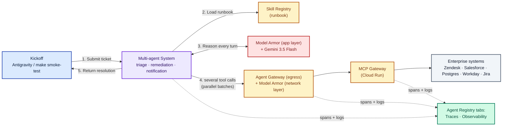

# Scenario A — Autonomous Remediation

*High-level components and request flow for end-to-end incident resolution.*

**Model:** Gemini 3.5 Flash **·** **Runbook source:** Skill Registry **·** **Kickoff:** via Antigravity Agent panel or `make smoke-test`

## Diagram

## What happens, end-to-end — and where to watch it in Console

| Step | What | Watch in Console |
|:---:|---|---|
| 1 | Kicked off programmatically — via `make smoke-test`, an Antigravity Agent panel prompt, or a message from the Playground tab. | Agent Registry → Playground |
| 2 | The agent system pulls the latest runbook from **Skill Registry** by name. | Traces tab → `load_skill` span |
| 3 | Every reasoning turn passes through **Model Armor** (app-layer callback) before reaching Gemini. Unconditional firewall. | Security tab |
| 4 | The agent issues several MCP tool calls — many in **parallel batches** — through Agent Gateway egress (network-layer Model Armor + Agent Identity mTLS) to the Cloud Run gateway and on to the mocked enterprise systems. Customer SLA fetched, JVM stack trace pulled, on-call identified, Jira bug filed, heap expanded 2GB→4GB, sync retried. | Traces tab → parallel-batch spans; Topology tab → agent ↔ Agent Gateway ↔ MCP edges |
| 5 | Only the **notification sub-agent** writes back to Zendesk (least privilege) and returns the resolution summary. | Traces tab → Author field changes to `notification_agent` |
| ★ | Throughout: every span and tool call lands in **Cloud Trace + Cloud Logging** automatically, surfaced pre-scoped to this agent. | Observability tab |

---

*Enterprise Support Agent — L400 demo.*
