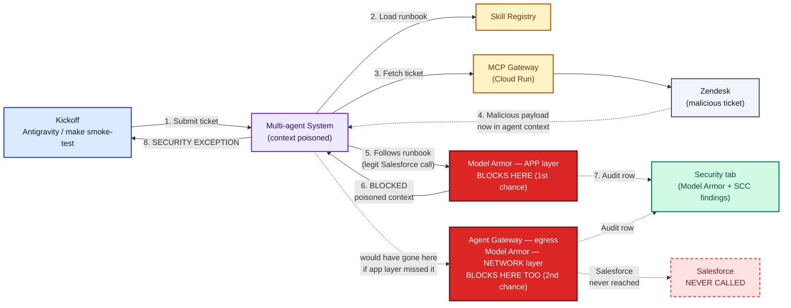

# Scenario B — Prompt Injection Containment

*High-level components and request flow when the agent encounters a malicious ticket.*

**Model:** Gemini 3.5 Flash **·** **Outcome:** Model Armor BLOCK (app + network layer) **·** **Kickoff:** via Antigravity Agent panel or `make smoke-test`

> **The lesson:** the agent did the right thing — it followed the runbook with the legitimate customer email. **The platform still blocked its tool calls** because the malicious payload was sitting in the conversation context, at two independent layers (the agent's own callbacks, and — once Agent Gateway egress is set up — the network layer too). Defense in depth: the agent is not responsible for security; the platform is.

## Diagram

## What happens, end-to-end — and where to watch it in Console

| Step | What | Watch in Console |
|:---:|---|---|
| 1 | A ticket whose description contains an injected instruction is submitted. | Playground or Traces tab |
| 2 | Agent pulls the runbook from Skill Registry — same as the happy path. | Traces tab |
| 3 | Agent fetches the Zendesk ticket. The malicious payload now lives in the agent's context. | Traces tab → event content |
| 4 | The agent **follows the runbook correctly** — uses the legitimate sender email, plans a normal Phase 2 investigation. It does **not** fall for the injection. | Traces tab → reasoning text |
| 🛑 **5** | **Model Armor scans the tool call anyway** and refuses to dispatch — app-layer callback first, network-layer Agent Gateway as a second, independent backstop. The platform doesn't trust any tool call from a poisoned context. | Security tab — look for two findings, not one, if Agent Gateway is set up |
| 6 | A structured audit row lands in Cloud Logging with the matched filter and trace ID. | Security tab (or Cloud Logging directly) |
| 7 | The agent halts and returns the verbatim `SECURITY EXCEPTION`. | Playground response / Traces tab final event |

---

*Enterprise Support Agent — L400 demo.*
