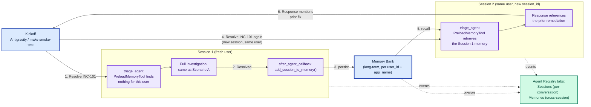

# Scenario C — Long-Term Memory Recall

*Two sessions, same incident — what Memory Bank changes about the second one.*

**Feature:** Memory Bank + `PreloadMemoryTool` **·** **Kickoff:** via Antigravity Agent panel or `make smoke-test` (includes Scenario C)

> **The lesson:** Sessions only hold the current conversation — replaying the same ticket in a brand-new session gives the agent zero built-in memory of the first run. Memory Bank is what closes that gap: a fact persisted after the first session, recalled at the start of the second, silently injected into the system instruction before the model ever sees the user's message.

## Diagram

## What happens, end-to-end — and where to watch it in Console

| Step | What | Watch in Console |
|:---:|---|---|
| 1 | First session: a fresh synthetic user resolves INC-101 exactly like Scenario A — no memory exists yet for this user. | Sessions tab → first session |
| 2 | The session ends; `triage_agent`'s `after_agent_callback` calls `add_session_to_memory()`, generating a long-term fact from the conversation. | Memories tab → new entry appears |
| 3 | Second session, same user, brand-new `session_id`: the same prompt is sent again. | Sessions tab → second, separate session |
| 4 | `PreloadMemoryTool` retrieves the memory and silently injects a `<PAST_CONVERSATIONS>` block into the system instruction — it never shows up as its own tool-call event, which is why this scenario asserts on the response text, not a trace span. | Traces tab → no discrete `preload_memory` span, by design |
| 5 | The response references the prior incident/remediation instead of presenting it as brand-new. | Playground response / `smoke_test.py` output |

---

*Enterprise Support Agent — L400 demo.*
